# 🚀 Vercel Deployment with Quality Gates

## Overview

This workflow provides comprehensive quality gates to prevent deploying breaking changes to Vercel. Vercel handles the actual deployment automatically when code is pushed to main.

## Workflow Trigger

```yaml
on:
  push:
    branches: [main]
  pull_request:
    branches: [main]
```

**Quality checks run on:**
- Every push to main branch
- Every pull request to main branch

**Vercel deployment happens automatically** after quality checks pass.

## Quality Gates 🛡️

### Job 1: Quality Gates
Prevents deployment of breaking changes by running comprehensive checks:

| Check | Purpose | Blocks Deployment On |
|-------|---------|---------------------|
| **TypeScript Check** | Type safety validation | Type errors |
| **ESLint** | Code quality standards | Linting errors |
| **Prettier** | Code formatting consistency | Formatting issues |
| **Security Audit** | Vulnerability scanning | Moderate+ vulnerabilities |
| **Vulnerability Check** | Deep security analysis | Known security issues |

### Job 2: Vercel Build Test
Validates the build process that Vercel will use:

| Step | Purpose | Validates |
|------|---------|-----------|
| **Production Build** | Test Vercel build process | Build compatibility |
| **Server Start Test** | Verify production server | Runtime functionality |
| **Build Validation** | Ensure deployment readiness | Production build works |

### Job 3: Deployment Ready
Informational status when ready for Vercel deployment:

| Step | Purpose | Action |
|------|---------|--------|
| **Success Notification** | Confirm readiness | Quality gates passed |
| **Deployment Info** | Show deployment URLs | Vercel URLs provided |

## Vercel Integration

### Automatic Deployment

```mermaid
graph TD
    A[Push to main] --> B[GitHub Actions: Quality Gates]
    B --> C{All checks pass?}
    C -->|No| D[❌ Block deployment]
    C -->|Yes| E[✅ Quality gates pass]
    E --> F[Vercel: Auto-deploy]
    F --> G[🚀 Live on Vercel]
```


### Vercel Configuration
- **Framework**: Next.js (auto-detected)
- **Build Command**: `npm run build`
- **Output Directory**: `.next` (default)
- **Install Command**: `npm ci`

## Environment Variables

### Vercel Dashboard Setup
```bash
# Production environment variables (set in Vercel dashboard):
NEXT_PUBLIC_SHOPIFY_DOMAIN=your-store.myshopify.com
NEXT_PUBLIC_SHOPIFY_STOREFRONT_ACCESS_TOKEN=your_real_token

# Preview deployments can use dummy values or real values
```

### CI Testing
```bash
# GitHub Actions uses dummy environment variables for testing:
NEXT_PUBLIC_SHOPIFY_DOMAIN=dummy-store.myshopify.com
NEXT_PUBLIC_SHOPIFY_STOREFRONT_ACCESS_TOKEN=dummy-token-for-ci
```

## Deployment Flow

```mermaid
graph TD
    A[Developer pushes code] --> B[GitHub Actions runs]
    B --> C[Quality Gates]
    C --> D{Pass?}
    D -->|No| E[❌ PR fails]
    D -->|Yes| F[Build Test]
    F --> G{Build works?}
    G -->|No| H[❌ Build fails]
    G -->|Yes| I[✅ Ready for deployment]
    I --> J[Vercel auto-deploys]
    J --> K[🚀 Live on Vercel]
```



## Preventing Breaking Changes

### TypeScript Errors
```bash
# Blocks deployment on:
- Type errors
- Missing type definitions
- Interface mismatches
```

### Code Quality Issues
```bash
# Blocks deployment on:
- ESLint errors (warnings allowed)
- Unformatted code
- Inconsistent code style
```

### Security Vulnerabilities
```bash
# Blocks deployment on:
- npm audit findings (moderate+)
- Known security vulnerabilities
- Dependency security issues
```

### Build Failures
```bash
# Blocks deployment on:
- Next.js build failures
- Missing dependencies
- Runtime errors during build
```

## Vercel Setup

### Connect Repository
1. **Go to Vercel Dashboard**
2. **Import Git Repository**
3. **Select your GitHub repository**
4. **Configure project settings**

### Environment Variables
```bash
# Add in Vercel Dashboard → Settings → Environment Variables:
NEXT_PUBLIC_SHOPIFY_DOMAIN = your-store.myshopify.com
NEXT_PUBLIC_SHOPIFY_STOREFRONT_ACCESS_TOKEN = your_real_token
```

### Deployment Settings
```bash
# Vercel auto-detects:
- Framework: Next.js
- Build Command: npm run build
- Output Directory: .next
- Install Command: npm ci
```

## Accessing Your Deployed Site

### Production URL
```
https://thecatmanor.vercel.app
```

### Custom Domain (Optional)
```
https://your-custom-domain.com
```

### Preview Deployments
```
https://thecatmanor-git-feature-branch.vercel.app
```

## Monitoring Deployments

### GitHub Actions
- View quality check results
- Monitor build status
- Debug failed checks

### Vercel Dashboard
- View deployment history
- Monitor performance
- Check build logs
- Configure custom domains

## Benefits Over GitHub Pages

### ✅ **Server-Side Rendering**
- Full Next.js features available
- API routes supported
- Dynamic rendering possible

### ✅ **Environment Variables**
- Real Shopify integration in production
- Secure secret management
- Environment-specific configuration

### ✅ **Performance**
- Edge network deployment
- Automatic optimization
- Image optimization included

### ✅ **Developer Experience**
- Automatic preview deployments
- Branch-based previews
- Instant rollbacks

## Troubleshooting

### Common Issues

#### Quality Gates Fail
```bash
# Check GitHub Actions logs for:
- TypeScript errors
- ESLint violations
- Security vulnerabilities
- Build failures
```

#### Vercel Deployment Fails
```bash
# Check Vercel dashboard for:
- Environment variable issues
- Build command errors
- Dependency problems
- Memory/timeout issues
```

#### Site Functionality Issues
```bash
# Verify:
- Environment variables in Vercel
- Shopify API credentials
- API route functionality
- Client-side code errors
```

### Manual Deployment Trigger
```bash
# From Vercel dashboard:
1. Go to Deployments tab
2. Click "Redeploy" on latest deployment
3. Select "Use existing build cache" or "Rebuild"
```

## Workflow Customization

### Stricter Quality Gates
```yaml
# Add to workflow:
- name: Run tests
  run: npm test

- name: Check bundle size
  run: npx bundlesize

- name: Lighthouse CI
  run: npx lhci autorun
```

### Different Environments
```yaml
# Deploy to staging on develop branch:
if: github.ref == 'refs/heads/develop'
# Deploy to production on main branch:
if: github.ref == 'refs/heads/main'
```

---

## 🎯 **Result: Production-Ready Vercel Pipeline**

Your Cat Manor site now has enterprise-grade deployment protection:
- **Quality gates prevent broken deployments**
- **Automatic security scanning**
- **Vercel-optimized build process**
- **Full Next.js feature support**
- **Real Shopify integration in production**

**Every push to main triggers quality checks, and only clean, secure code gets deployed to Vercel!** ✨
